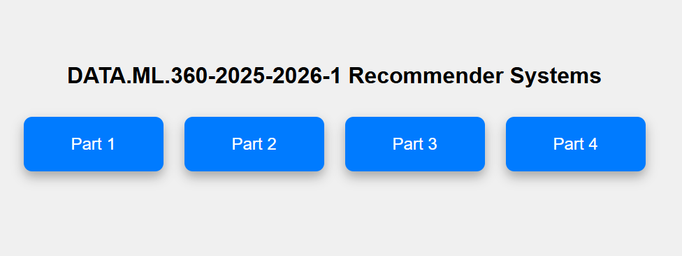
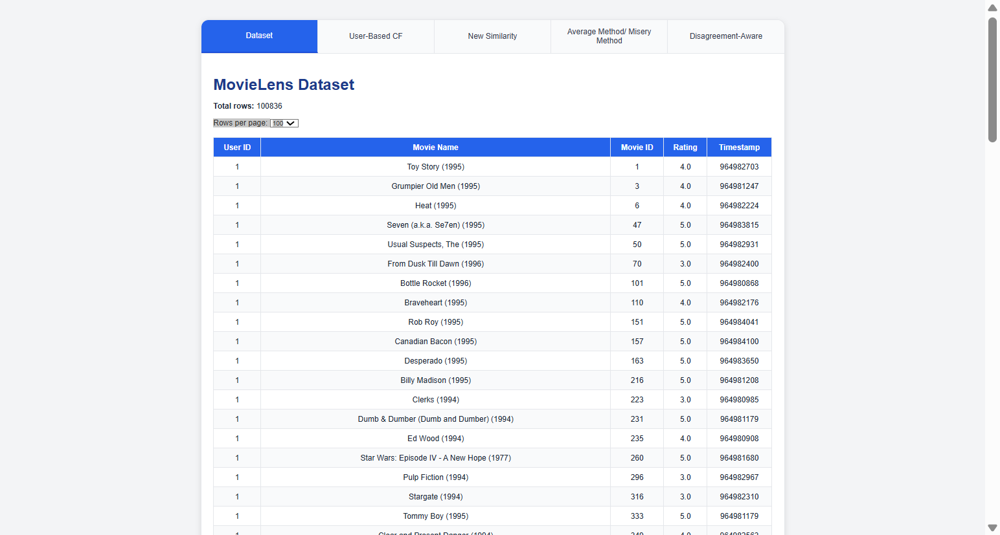
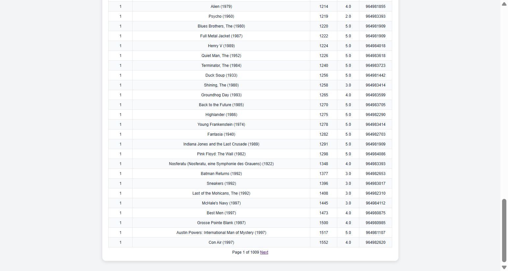
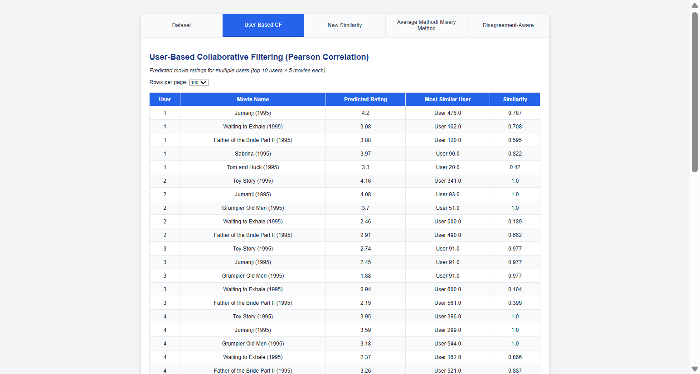
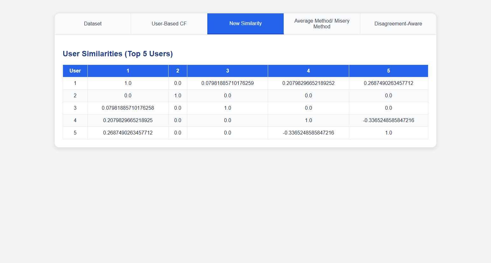
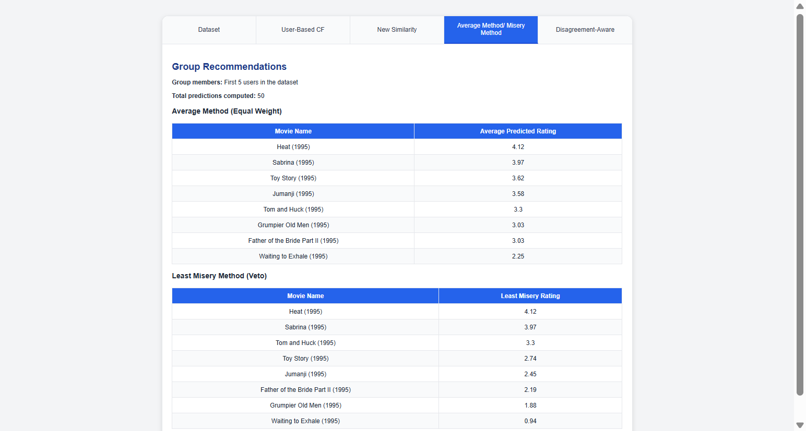
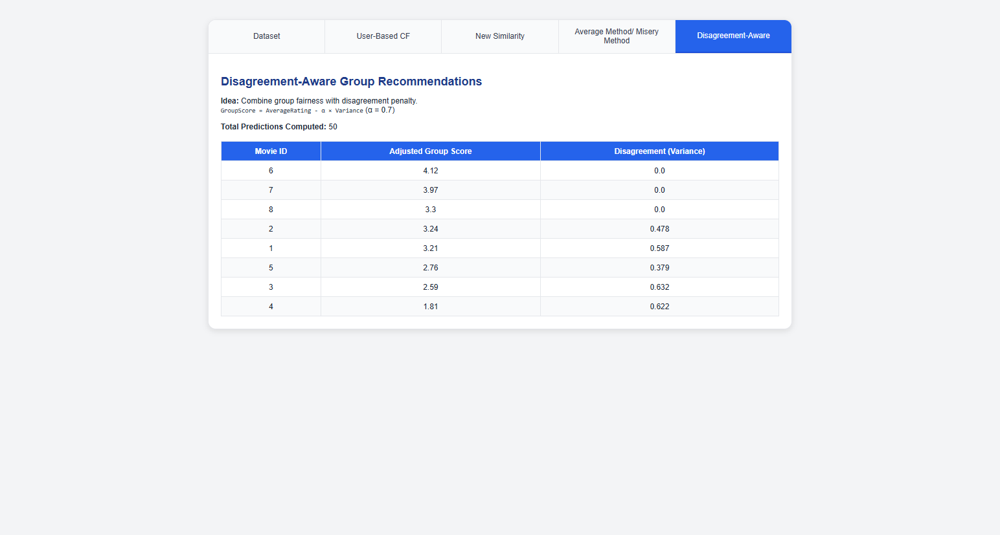
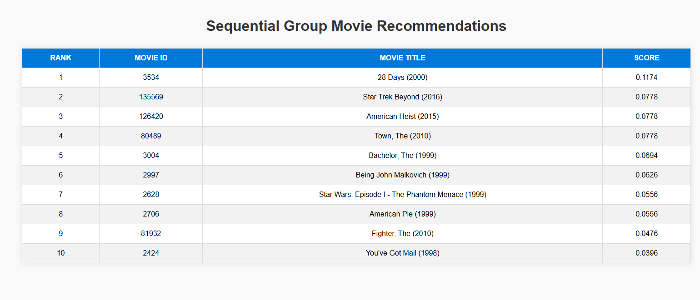
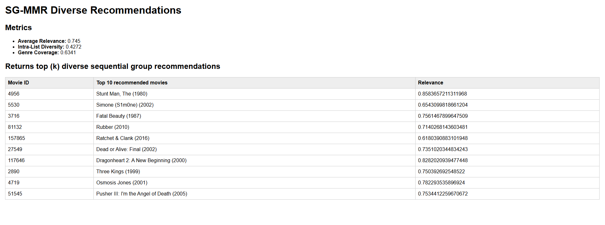
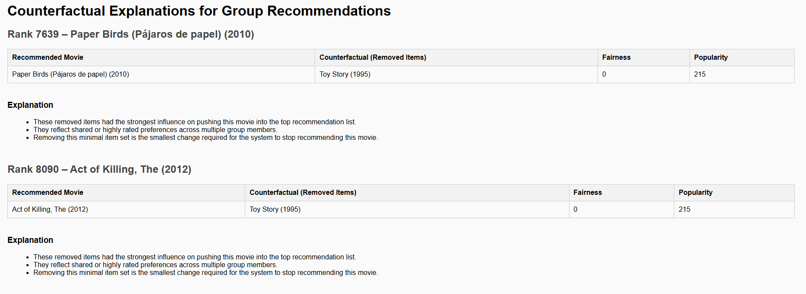

## 📦 Recommender System Project

This project implements a Sequential Group Recommendation System using Markov Chains..

🔗 **GitHub Repository:** [recommenderSystemProject](https://github.com/MasoodAhmadi/recommenderSystemProject)


# 🎥 Recommender System Dashboard

Welcome to the **Recommender System Course**! This project work part 1 ,part 2 and part 3 are built with Flask that demonstrates various recommendation techniques, including collaborative filtering, group recommendations, and disagreement-aware methods. The system uses the MovieLens dataset to showcase its functionality.

---

## 🛠️ Installation and Setup

Follow these steps to set up the project on your local machine:

Note: you can find requirements.txt file or install the library by your own devices. 

Make sure you are in the root folder of the project (where app.py is located), then start the Flask application using the following command:

```bash
flask --app app.py run
```

### 1. Clone the Repository

```bash
git clone git@github.com:MasoodAhmadi/recommenderSystemProject.git
cd recommenderSystem
```
---

## 🌟 Features

1. **Dashboard recommender system project**  
   You can navigate in each part by clicking the buttons below: 
    

## 🌟 Part1 
  
1. **Dataset Viewer**  
   View and explore the MovieLens dataset with pagination support.

  
    
---
   

2. **User-Based Collaborative Filtering**  
   Generate personalized recommendations using Pearson or Cosine similarity.

   

3. **User Similarity Matrix**  
   Visualize the similarity between users based on their ratings.

   

4. **Group Recommendations**  
   Explore group-based recommendations using the Average and Least Misery methods.

   

5. **Disagreement-Aware Recommendations**  
   Incorporate disagreement-aware scoring to balance group preferences.

   


## 🌟 Part2

1. **Sequential Group Recommendations**  
   
   

## 🌟 Part3

1. **Diverse Recommendations**  
   
   

1. **Counterfactual Explanation**  
   
   