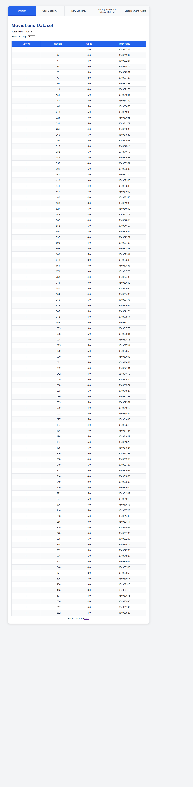
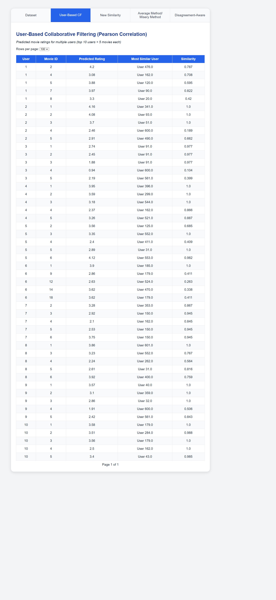
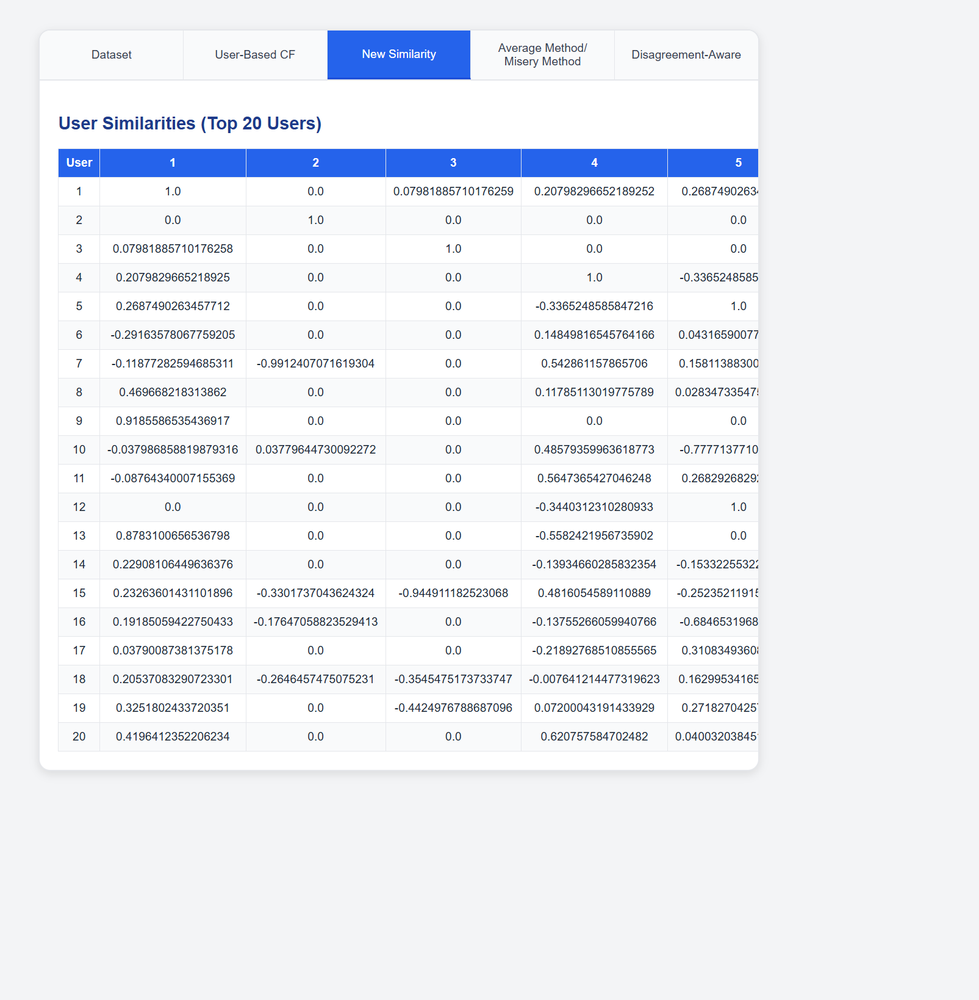
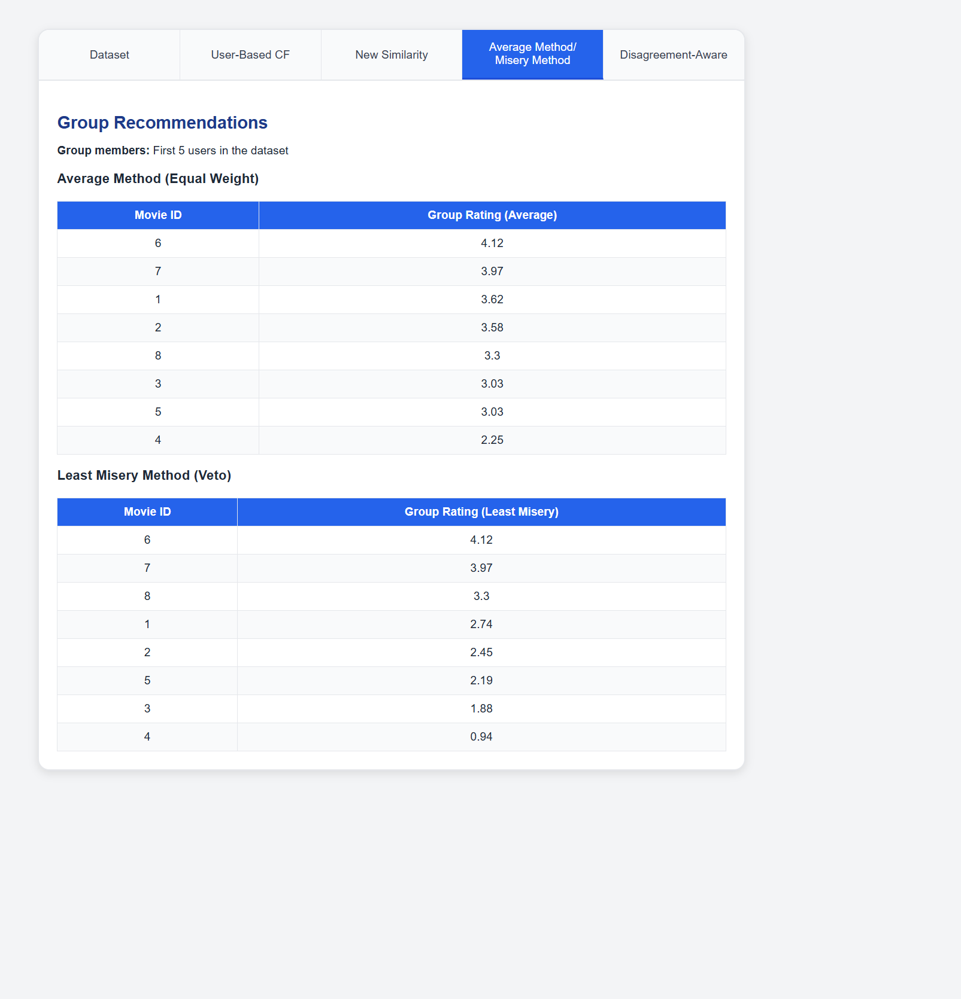
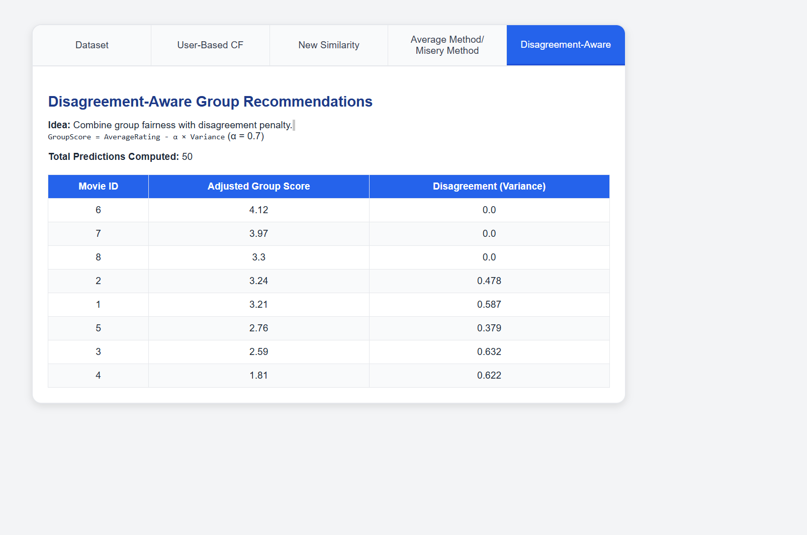

# 🎥 Recommender System Dashboard

Welcome to the **Recommender System Course**! This project work part 1 is built with Flask that demonstrates various recommendation techniques, including collaborative filtering, group recommendations, and disagreement-aware methods. The system uses the MovieLens dataset to showcase its functionality.

---

## 🌟 Features

1. **Dataset Viewer**  
   View and explore the MovieLens dataset with pagination support.

   

2. **User-Based Collaborative Filtering**  
   Generate personalized recommendations using Pearson or Cosine similarity.

   

3. **User Similarity Matrix**  
   Visualize the similarity between users based on their ratings.

   

4. **Group Recommendations**  
   Explore group-based recommendations using the Average and Least Misery methods.

   

5. **Disagreement-Aware Recommendations**  
   Incorporate disagreement-aware scoring to balance group preferences.

   

---

## 🛠️ Installation and Setup

Follow these steps to set up the project on your local machine:

Make sure you are in the root folder of the project (where app.py is located), then start the Flask application using the following command:

```bash
flask --app app.py run

### 1. Clone the Repository


git clone git@github.com:MasoodAhmadi/recommenderSystemProject.git
cd recommenderSystem
```
